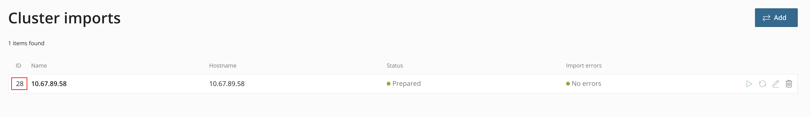

Conversion of SolusVM 1 Hostbill service to SolusVM 2 Hostbill service
=======

Conversion is supported only for SolusVM 1 products/services that were created and configured according to [Hostbill documentation](https://hostbill.atlassian.net/wiki/spaces/DOCS/pages/1213263/SolusVM).

Before conversion:
1. Version of SolusVM 2 should be higher than 2.0.0-32632.
2. Be sure that all servers were imported from SolusVM 1 to SolusVM 2.
3. Install `solusio` module and configure its API connection. [more](https://hostbill.atlassian.net/wiki/spaces/DOCS/pages/1723334657/SolusVM+2)

Install the converter:
1. Download zip-archive with converter: `wget https://github.com/solusio/hostbill-converter/archive/refs/heads/main.zip`
2. Extract downloaded archive to Hostbill modules directory: `unzip main.zip -d [path to your application]/includes/modules/Hosting`.
3. Go to converter directory `cd [path to your application]/includes/modules/Hosting/hostbill-converter`.

### Full conversion
This is one-way conversion - it will not be possible to restore converted SolusVM 2 product back to SolusVM 1.
1. Create new order page for SolusVM 2 products with properly order type [admin -> Settings -> Products & Services]. [more](https://hostbill.atlassian.net/wiki/spaces/DOCS/pages/2004287489/SolusIO+-+VPS+Package+-+pre-paid+billing)

2. Run `php index.php prepare` to load necessary data from SolusVM 2.
   This step can take for example more than 5 minutes for loading 10000 servers.
   Available flags:
   * `--cluster-import` - ID of cluster import in SolusVM 2.

     

   If you have more than one cluster imports in SolusVM 2, you can use this argument to point converter to necessary cluster import.
   If you don't pass this argument, command get cluster import ID automatically.

3. Run `php index.php reconfigure` to convert all SolusVM 1 products into the SolusVM 2 products. Available flags:
   * `--order-page` - ID of order page for SolusVM 2 products. (required)
   * `--limit-group` - ID of limit group (required). Can be found in SolusVM 2 admin panel > Access > Limit Groups
   * `--kvm-plan` - ID of KVM plan, needed if we can't find plan by plan name which is used in SolusVM 1 product.
   * `--vz-plan` - ID of VZ plan, needed if we can't find plan by plan name which is used in SolusVM 1 product.
   * `--vz-os-image` - ID of VZ OS image, needed if we can't find OS image by template which is used in SolusVM 1 product.
   * `--kvm-os-image` - ID of KVM OS image, needed for KVM products because we don't import KVM OS images from SolusVM 1.
   * `--location` - ID of location, needed if we can't find location by Node Group name which is used in SolusVM 1 product.
   * `--role` - ID of role (optional, default value is ID of role with name "CLIENT")
   
   Flags for location, plans, OS images are optional. 
   If you omit them empty and script can't find imported entities, 
   then product allows client to select necessary options manually during checkout.
   We recommend you to check location, plan and OS image of converted products in Hostbill.

### Partial conversion
This conversion duplicates SolusVM 1 Hostbill order pages and converts them to SolusVM 2.
SolusVM 1 accounts are converted into SolusVM 2 accounts if related SolusVM 1 servers were imported into SolusVM 2.
It is possible to revert converted SolusVM 2 account back to SolusVM 1.
1. Run `php index.php prepare` to load necessary data from SolusVM 2.
   This step can take for example more than 5 minutes for loading 10000 servers.
   Available flags:
   * `--cluster-import` - ID of cluster import in SolusVM 2.

   If you have more than one cluster imports in SolusVM 2, you can use this argument to point converter to necessary cluster import.
   If you don't pass this argument, command get cluster import ID automatically.

2. Run `php index.php copy-order-pages` to duplicate SolusVM 1 order page with its products to SolusVM 2 order page with converted products. Available flags:
   * `--limit-group` - ID of limit group (required). Can be found in SolusVM 2 admin panel > Access > Limit Groups
   * `--kvm-plan` - ID of KVM plan, needed if we can't find plan by plan name which is used in SolusVM 1 product.
   * `--vz-plan` - ID of VZ plan, needed if we can't find plan by plan name which is used in SolusVM 1 product.
   * `--vz-os-image` - ID of VZ OS image, needed if we can't find OS image by template which is used in SolusVM 1 product.
   * `--kvm-os-image` - ID of KVM OS image, needed for KVM products because we don't import KVM OS images from SolusVM 1.
   * `--location` - ID of location, needed if we can't find location by Node Group name which is used in SolusVM 1 product.
   * `--role` - ID of role (optional, default value is ID of role with name "CLIENT")

   Flags for location, plans, OS images are optional.
   If you omit them empty and script can't find imported entities,
   then product allows client to select necessary options manually during checkout.
   We recommend you to check location, plan and OS image of converted products in Hostbill.

3. (Optional) Run `php index.php dry-run` to see list of accounts to convert and revert conversion command

4. Run `php index.php convert-accounts` to convert SolusVM 1 accounts to SolusVM 2 accounts if its servers were imported

5. Run `php index.php revert-accounts --accounts=1,2` to revert conversion of converted to SolusVM 2 accounts with ID`s 1 and 2 to SolusVM 1 if it is needed. Available flags:
   * `--accounts` - list of SolusVM 2 account ID`s to convert them back to SolusVM 1 account

6. To continue conversion process run `php index.php prepare-servers` to load new information about imported SolusVM 2 servers and then go to step 4 again